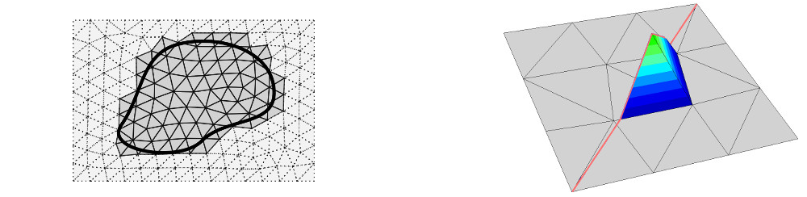
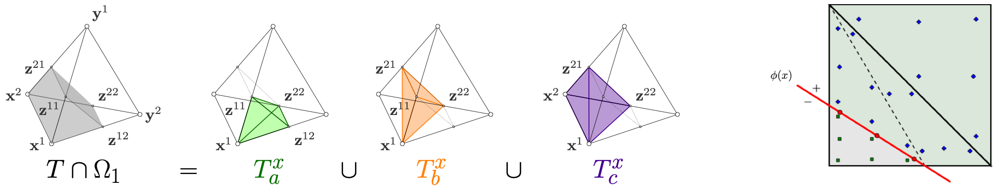
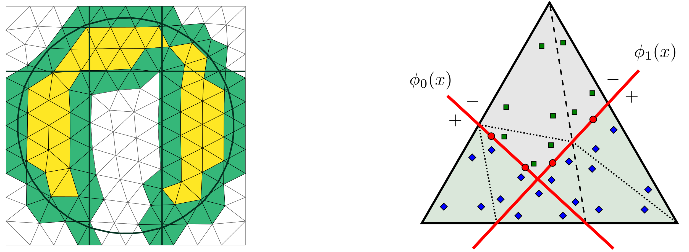
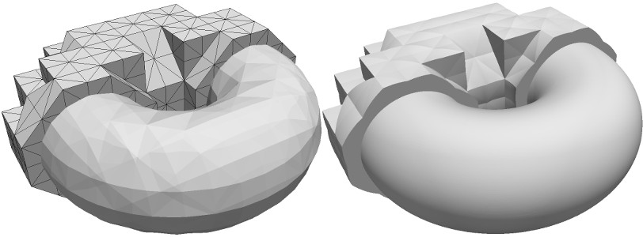
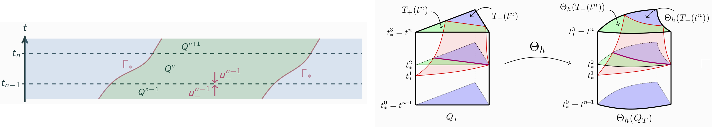
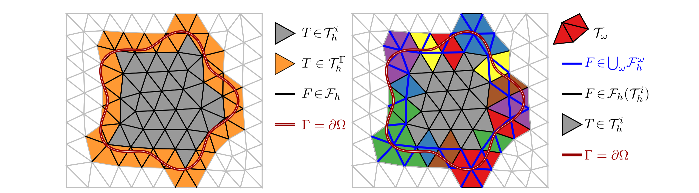

---
Feature details of `ngsxfem`
---

### Tools to work on an "active mesh" only
In unfitted finite element methods some functions and integrals are only defined on a subset of the mesh. Accordingly finite element spaces and integrals have to be defined only on this active part of the mesh. 
`ngsxfem` offers the tools to mark the corresponding elements and facets and use the marking during assembly and definition of finite element spaces. 
On cut elements one often also uses locally modified finite elements, e.g. by restriction of finite elements on the background mesh.

### Numerical integration on unfitted geometries described by one level set function
Given a level set function $\phi$ which describes the geometry (e.g. $\Omega = \{ \phi < 0 \}$), a piecewise linear (or bilinear on hyperrectangles) approximation is made. How to obtain a higher order reconstruction from this basis approximation is discussed [below](#higher-order-representation-of-implicit-level-set-geometries).

On simplices (triangles and tetrahedra) this gives a planar intersection on every element which allows for an explicit decomposition into simple geometries.
On these simple (uncut) geometries standard quadrature rules of arbitrary order can be applied which results in quadrature rules for the (approximated) sub-domains where the level set is positive/negative/zero.

### Geometries described by multiple level sets
While one level set function may be sufficient for the approximation of a smooth geometry, many geometries do not have -- due to sharp corners or edges -- an implicit description by only one *smooth* level set function. In these cases often multiple level set functions can be used to describe theses geometries. 
To work with these more complicated domains, `ngsxfem` provides tools to work with these geometries as with simple geometries, for example computing the level set description of the boundary and exterior.  To enable integration on such domains `ngsxfem` generates quadrature rules with respect to every level set which cuts a given element. Furthermore, it provides the analogous tools to the single level-set setting, to mark those elements of the mesh which are relevant to a given geometry.

### Higher order representation of implicit level-set geometries 
To obtain higher order accuracy in the handling of the geometry, `ngsxfem` offers a mesh transformation technique in the spirit of isoparametric finite element methods. 
Thereby the piecewise linear approximation of the level set (which is only of second order) is mapped onto a higher order accurate approximation of the true geometry.

### Space-Time Finite Elements for the treatment of moving domain problems
To obtain robust methods for partial differential equations on unfitted moving domain we can formulate space-time discretizations. `ngsxfem` provides the necessary tools to define space-time finite element spaces and to integrate on space-time domains. Furthermore, it extends the tools for higher order accurate geometry handling into the space-time setting.

### Patches for Element Aggregation or Ghost Penalties
To stabilize small cut configurations `ngsxfem` allows to apply Ghost Penalty stabilizations which however increases the number of couplings. To reduce the couplings a minimum set of stabilization facets can be obtain by selecting stabilization patches on which stabilization is active. Alternatively an aggregation method can be used to extend shape functions from the stable interior to ill-cut elements. The basis for both is the selection of element aggregation patches and corresponding operations.

